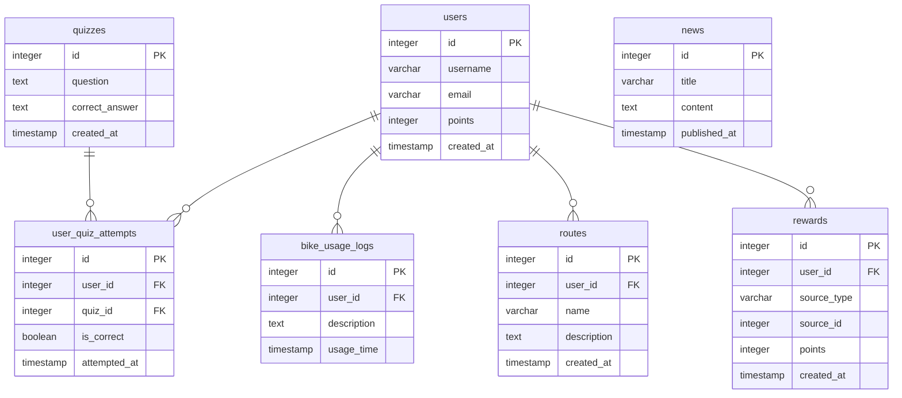

# Entity Relationship Diagram

```mermaid
erDiagram
    users {
        integer id PK
        varchar username
        varchar email
        integer points
        timestamp created_at
    }
    quizzes {
        integer id PK
        text question
        text correct_answer
        timestamp created_at
    }
    user_quiz_attempts {
        integer id PK
        integer user_id FK
        integer quiz_id FK
        boolean is_correct
        timestamp attempted_at
    }
    bike_usage_logs {
        integer id PK
        integer user_id FK
        text description
        timestamp usage_time
    }
    news {
        integer id PK
        varchar title
        text content
        timestamp published_at
    }
    routes {
        integer id PK
        integer user_id FK
        varchar name
        text description
        timestamp created_at
    }
    rewards {
        integer id PK
        integer user_id FK
        varchar source_type
        integer source_id
        integer points
        timestamp created_at
    }

    users ||--o{ user_quiz_attempts : "" 
    quizzes ||--o{ user_quiz_attempts : "" 
    users ||--o{ bike_usage_logs : "" 
    users ||--o{ routes : "" 
    users ||--o{ rewards : "" 
```
