# Entity Relationship Diagram

```mermaid
erDiagram
    users {
        integer id PK
        varchar kakao_id
        varchar username
        varchar email
        integer points
        integer level
        integer experience_points
        timestamp created_at
    }

    user_levels {
        integer level PK
        varchar level_name
        integer required_exp
        text description
        text benefits
    }

    user_settings {
        integer id PK
        integer user_id FK
        boolean notification_enabled
        boolean location_sharing
        varchar privacy_level
        text preferences
        timestamp updated_at
    }

    user_verifications {
        integer id PK
        integer user_id FK
        varchar verification_type
        integer source_id
        varchar status
        text proof_data
        timestamp verified_at
        timestamp created_at
    }

    quizzes {
        integer id PK
        string question
        string correct_answer
        string[] answers
        timestamp created_at
    }

    user_quiz_attempts {
        integer id PK
        integer user_id FK
        integer quiz_id FK
        boolean is_correct
        timestamp attempted_at
    }

    bike_usage_logs {
        integer id PK
        integer user_id FK
        string description
        decimal start_latitude
        decimal start_longitude
        decimal end_latitude
        decimal end_longitude
        decimal distance
        integer duration_minutes
        timestamp start_time
        timestamp end_time
        varchar status
        timestamp usage_time
    }

    news {
        integer id PK
        varchar title
        string content
        timestamp published_at
    }

    routes {
        integer id PK
        integer user_id FK
        varchar name
        string description
        decimal total_distance
        integer estimated_duration
        varchar difficulty_level
        timestamp created_at
    }

    route_points {
        integer id PK
        integer route_id FK
        decimal latitude
        decimal longitude
        integer sequence_order
        varchar point_type
        text description
        timestamp recorded_at
    }

    rewards {
        integer id PK
        integer user_id FK
        varchar source_type
        integer source_id
        integer points
        integer experience_points
        varchar reward_reason
        varchar status
        timestamp created_at
    }

    community_posts {
        integer id PK
        integer user_id FK
        varchar title
        text content
        varchar post_type
        integer likes_count
        integer comments_count
        varchar status
        timestamp created_at
        timestamp updated_at
    }

    post_comments {
        integer id PK
        integer post_id FK
        integer user_id FK
        text content
        integer parent_comment_id FK
        timestamp created_at
    }

    post_likes {
        integer id PK
        integer post_id FK
        integer user_id FK
        timestamp created_at
    }

    notifications {
        integer id PK
        integer user_id FK
        varchar type
        varchar title
        text message
        text data
        boolean is_read
        timestamp scheduled_at
        timestamp sent_at
        timestamp created_at
    }

    safety_reports {
        integer id PK
        integer user_id FK
        varchar report_type
        decimal latitude
        decimal longitude
        text description
        varchar status
        text admin_response
        timestamp resolved_at
        timestamp created_at
    }

    favorites {
        integer id PK
        integer user_id FK
        varchar favorite_type
        integer target_id
        timestamp created_at
    }

    user_achievements {
        integer id PK
        integer user_id FK
        varchar achievement_type
        varchar title
        text description
        integer reward_points
        timestamp achieved_at
    }

    cycling_goals {
        integer id PK
        integer user_id FK
        varchar goal_type
        decimal target_value
        decimal current_value
        varchar period_type
        timestamp start_date
        timestamp end_date
        varchar status
        timestamp created_at
    }

    users ||--|| user_levels : "has level"
    users ||--o| user_settings : ""
    users ||--o{ user_verifications : ""
    users ||--o{ user_quiz_attempts : ""
    users ||--o{ bike_usage_logs : ""
    users ||--o{ routes : ""
    users ||--o{ rewards : ""
    users ||--o{ community_posts : "writes"
    users ||--o{ post_comments : "comments"
    users ||--o{ post_likes : "likes"
    users ||--o{ notifications : "receives"
    users ||--o{ safety_reports : "reports"
    users ||--o{ favorites : "has"
    users ||--o{ user_achievements : "earns"
    users ||--o{ cycling_goals : "sets"

    quizzes ||--o{ user_quiz_attempts : ""

    routes ||--o{ route_points : "contains"

    community_posts ||--o{ post_comments : "has"
    community_posts ||--o{ post_likes : "receives"

    post_comments ||--o{ post_comments : "replies"
```

## 주요 기능들 (앱 플로우 기반)

### 1. 개인 자전거 이용 기록 시스템

- **bike_usage_logs**: GPS 기반 이용 기록 (출발지, 도착지, 거리, 시간)
- **cycling_goals**: 개인 목표 설정 (일일/주간/월간 거리, 시간 등)

### 2. 지도 & 경로 기능

- **routes**: 사용자 생성 경로 및 추천 경로
- **route_points**: GPS 좌표 기반 상세 경로 정보
- **favorites**: 즐겨찾기 (경로, 장소 등)

### 3. 커뮤니티 기능

- **community_posts**: 게시글 (팁, 질문, 경로 공유 등)
- **post_comments**: 댓글 및 대댓글
- **post_likes**: 좋아요 시스템

### 4. 안전 & 알림 기능

- **notifications**: 푸시 알림 관리
- **safety_reports**: 안전 관련 신고 (위험 구간, 사고 등)

### 5. 게이미피케이션

- **user_achievements**: 업적 시스템 (첫 10km, 100km 달성 등)
- **rewards**: 포인트 및 경험치 시스템
- **user_levels**: 레벨 시스템

### 6. 개인 관리

- **user_settings**: 개인 설정 (알림, 프라이버시 등)
- **cycling_goals**: 개인 사이클링 목표 관리

이 ERD는 앱 플로우의 실제 기능에 맞춰:

- 🏠 홈화면 (이용 현황, 목표 달성률)
- 🗺️ 지도 (경로 안내, 안전 정보)
- 📊 이용 기록 (GPS 추적, 통계)
- 👥 커뮤니티 (게시글, 댓글, 좋아요)
- 🎯 목표 설정 (거리, 시간 목표)
- ⚙️ 설정 (개인화)
- 🏆 업적 시스템 (레벨업, 포인트)
